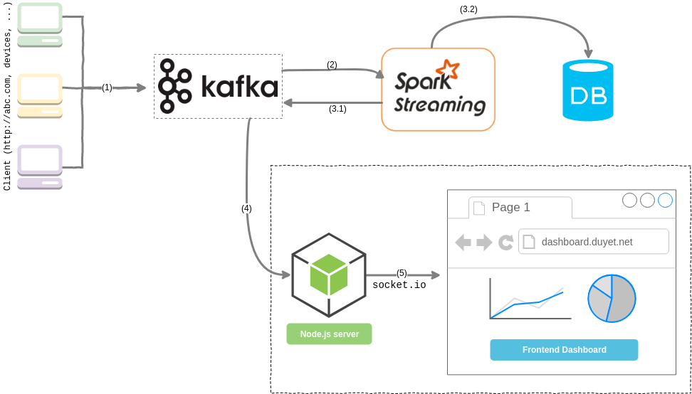
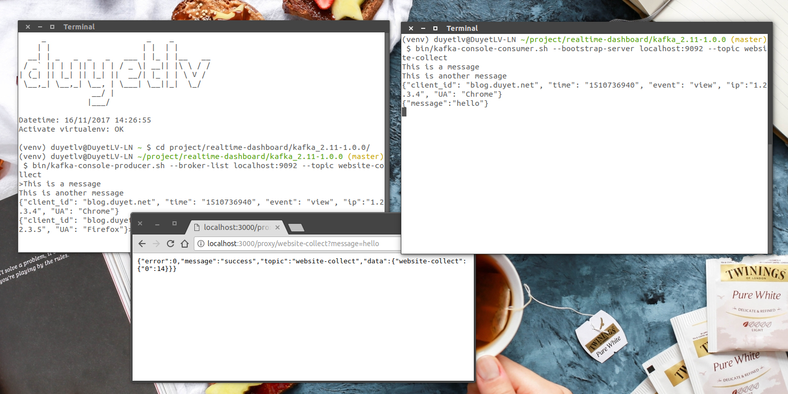

# Realtime Dashboard
Real-time report dashboard with Apache Kafka, Apache Spark Streaming and Node.js

**Support**

<a href="https://s.duyet.net/r/patreon"></a>




# Getting started

## 1. Setup environment

Clone this project

```sh
git clone https://github.com/duyetdev/realtime-dashboard.git
cd realtime-dashboard/

# Setup env
./bin/env.sh
```

Download [Apache Spark 2.2.0](http://spark.apache.org/downloads.html)

```sh
cd $RRD_HOME
wget http://archive.apache.org/dist/spark/spark-2.2.0/spark-2.2.0-bin-hadoop2.7.tgz
tar -xzf spark-2.2.0-bin-hadoop2.7.tgz
export SPARK_HOME=$RRD_HOME/spark-2.2.0-bin-hadoop2.7
```

Download Kafka
```sh
cd $RRD_HOME
wget http://mirrors.viethosting.com/apache/kafka/1.0.0/kafka_2.11-1.0.0.tgz
tar -xzf kafka_2.11-1.0.0.tgz
export KAFKA_HOME=$RRD_HOME/kafka_2.11-1.0.0
```

Install Node.js packages
```sh
npm install
```

## 2. Start Kafka Server

Start Zookeeper and Kafka
```sh
cd $RRD_HOME/kafka_2.11-1.0.0

# Start zookeeper
bin/zookeeper-server-start.sh config/zookeeper.properties &

# Start Kafka
bin/kafka-server-start.sh config/server.properties &
```

Create Topics
```sh
bin/kafka-topics.sh --create --zookeeper localhost:2181 --replication-factor 1 --partitions 1 --topic website-collect
bin/kafka-topics.sh --create --zookeeper localhost:2181 --replication-factor 1 --partitions 1 --topic website-report
```

We can't access Kafka directly via HTTP, so we start **Kafka Proxy** :
```sh
node nodejs-kafka-proxy/server.js

# [2017-11-16 14:24:03,008] INFO Accepted socket connection from /127.0.0.1:42984 (org.apache.zookeeper.server.NIOServerCnxnFactory)
# [2017-11-16 14:24:03,010] WARN Connection request from old client /127.0.0.1:42984; will be dropped if server is in r-o mode (org.apache.zookeeper.server.ZooKeeperServer)
# [2017-11-16 14:24:03,010] INFO Client attempting to establish new session at /127.0.0.1:42984 (org.apache.zookeeper.server.ZooKeeperServer)
# [2017-11-16 14:24:03,025] INFO Established session 0x15fc38ffab40011 with negotiated timeout 30000 for client /127.0.0.1:42984 (org.apache.zookeeper.server.ZooKeeperServer)
# Example app listening on port 3000!

```

Test (Optional) Kafka Produder and Consumer

Open two terminals:
```sh
# Terminal 1
$ bin/kafka-console-producer.sh --broker-list localhost:9092 --topic website-collect
This is a message
This is another message
{"client_id": "blog.duyet.net", "time": "1510736940", "event": "view", "ip":"1.2.3.4", "UA": "Chrome"}
{"client_id": "blog.duyet.net", "time": "1510736940", "event": "click", "ip":"1.2.3.5", "UA": "Firefox"}
```

```sh
# Terminal 2
$ bin/kafka-console-consumer.sh --bootstrap-server localhost:9092 --topic website-collect --from-beginning
This is a message
This is another message
{"client_id": "blog.duyet.net", "time": "1510736940", "event": "view", "ip":"1.2.3.4", "UA": "Chrome"}
{"client_id": "blog.duyet.net", "time": "1510736940", "event": "click", "ip":"1.2.3.5", "UA": "Firefox"}
```

Test proxy server:
```
http://localhost:3000/proxy/website-collect?message=hello
```

You will see in Consumer Kafka:




## 3. Apache Spark Streaming


Submit Spark Streaming script

```sh
# Usage: spark_server.py <zk> <input_topic> <output_topic>

$SPARK_HOME/bin/spark-submit --packages org.apache.spark:spark-streaming-kafka-0-8_2.11:2.0.2 \
    $RRD_HOME/spark/spark_server.py \
    localhost:2181 website-collect website-report
```
